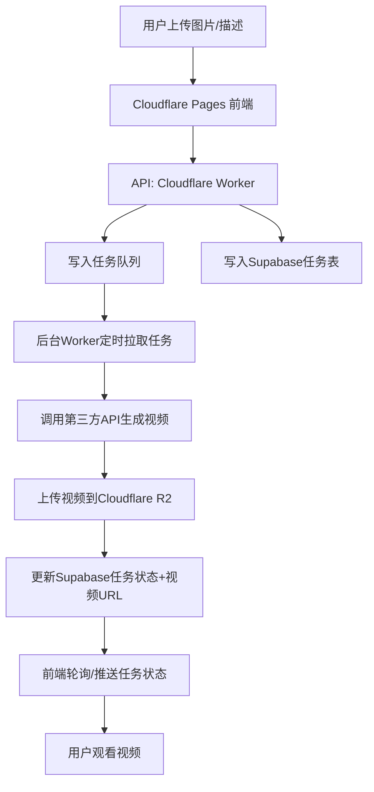

# Cloudflare 视频生成平台技术架构方案

## 1. 架构总览

本项目为“图片/文本转视频”平台，采用现代云原生架构，前端使用JS框架（如Next.js/React），部署在Cloudflare Pages，后端API与任务处理采用Cloudflare Workers、Cloudflare Queues（或Upstash）、Supabase数据库、Cloudflare R2存储，兼顾MVP快速上线与后续大规模扩展。

---

## 2. 技术选型

- **前端**：Cloudflare Pages（静态页面+JS框架，全球CDN，免费带宽）
- **API/任务入口**：Cloudflare Worker（Serverless，10秒超时，适合异步任务分发）
- **队列**：Cloudflare Queues（原生队列服务，或Upstash Queue，或Supabase队列表）
- **任务处理Worker/后台服务**：定时拉取队列任务，调用第三方API（如Runway、Pika、Kling等）生成视频
- **存储**：Cloudflare R2（大文件、低成本、全球加速）
- **数据库**：Supabase（PostgreSQL，免费额度，易用，支持REST和实时订阅）
- **通知/轮询**：前端定时查询任务状态，或WebSocket实时推送

---

## 3. MVP版本架构流程

1. **用户上传图片/填写描述**
2. **前端调用API（Cloudflare Worker）**
3. **API将任务写入队列（Cloudflare Queues/Upstash）和数据库（Supabase，记录任务状态）**
4. **API立即返回任务ID，前端进入“处理中”状态**
5. **后台Worker定时拉取队列任务，调用第三方API生成视频**
6. **生成后上传视频到R2，更新数据库任务状态和视频URL**
7. **前端定时轮询任务状态，完成后展示视频**

---

## 4. 流程图



---

## 5. 关键表结构设计（Supabase）

```sql
CREATE TABLE video_tasks (
  id uuid PRIMARY KEY DEFAULT gen_random_uuid(),
  user_id uuid,
  status text CHECK (status IN ('pending', 'processing', 'completed', 'failed')),
  input_image_url text,
  output_video_url text,
  prompt text,
  created_at timestamptz DEFAULT now(),
  updated_at timestamptz DEFAULT now()
);
```

---

## 6. 主要API接口设计

- **POST /api/generate-video**
  - 参数：图片URL/文件、描述
  - 返回：任务ID
- **GET /api/task-status/:id**
  - 返回：任务状态、视频URL

---

## 7. MVP实现建议

- **队列可用Supabase表模拟**（如无Cloudflare Queues权限）
- **Worker可用定时任务/外部服务实现**（如GitHub Actions、Railway等）
- **前端用简单轮询**，后续可升级WebSocket
- **所有API均为异步，避免超时**

---

## 8. 可扩展性设计

- 队列/Worker可横向扩展，支持高并发
- R2存储容量大，带宽不限
- Supabase支持实时订阅，后续可做推送
- 可接入更多第三方视频API
- 可拆分微服务，支持多团队协作

---

## 9. 后续升级建议

- 引入Cloudflare Queues原生队列，提升任务吞吐量
- Worker服务可用Docker容器部署，支持多实例
- 前端升级为WebSocket实时推送
- 增加用户通知（邮件/短信）
- 支持多种视频生成模型和参数

---

## 10. 兼容性与注意事项

- Cloudflare Worker单次请求10秒超时，必须异步
- R2上传大文件需用直传/分片
- Supabase免费版有连接数/带宽限制，用户多时需升级
- 队列服务选型需考虑Cloudflare生态兼容性

---

## 11. 参考链接
- [Cloudflare Pages](https://pages.cloudflare.com/)
- [Cloudflare Workers](https://workers.cloudflare.com/)
- [Cloudflare Queues](https://developers.cloudflare.com/queues/)
- [Cloudflare R2](https://developers.cloudflare.com/r2/)
- [Supabase](https://supabase.com/)

---

如需更详细的代码示例或具体实现细节，可随时补充！